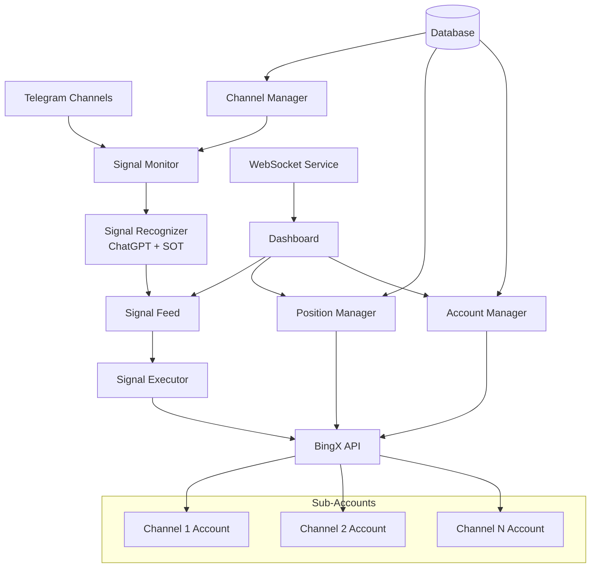
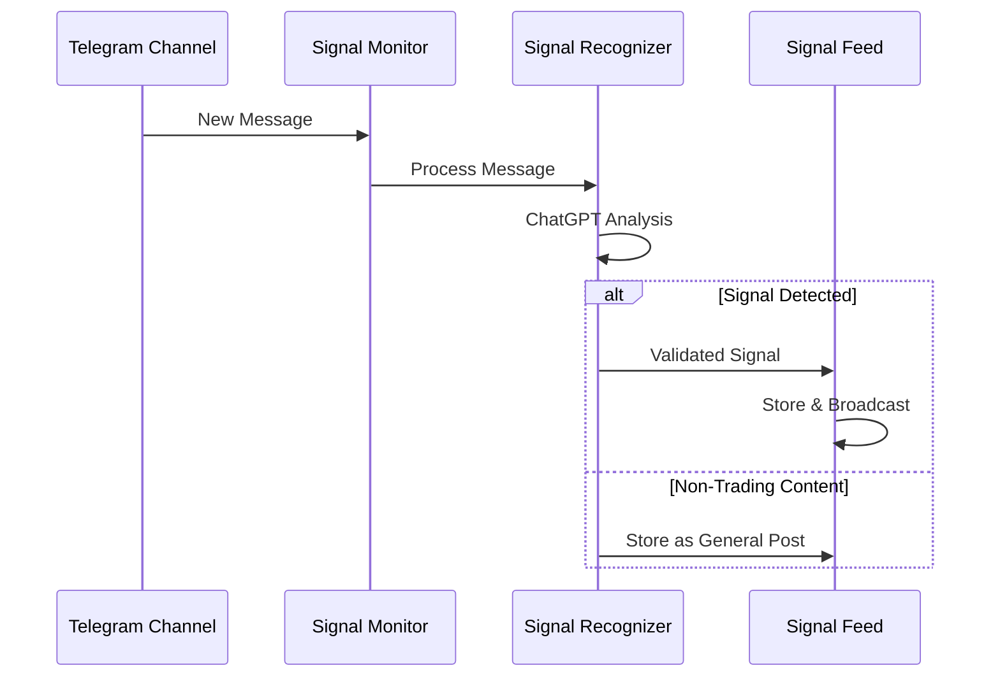
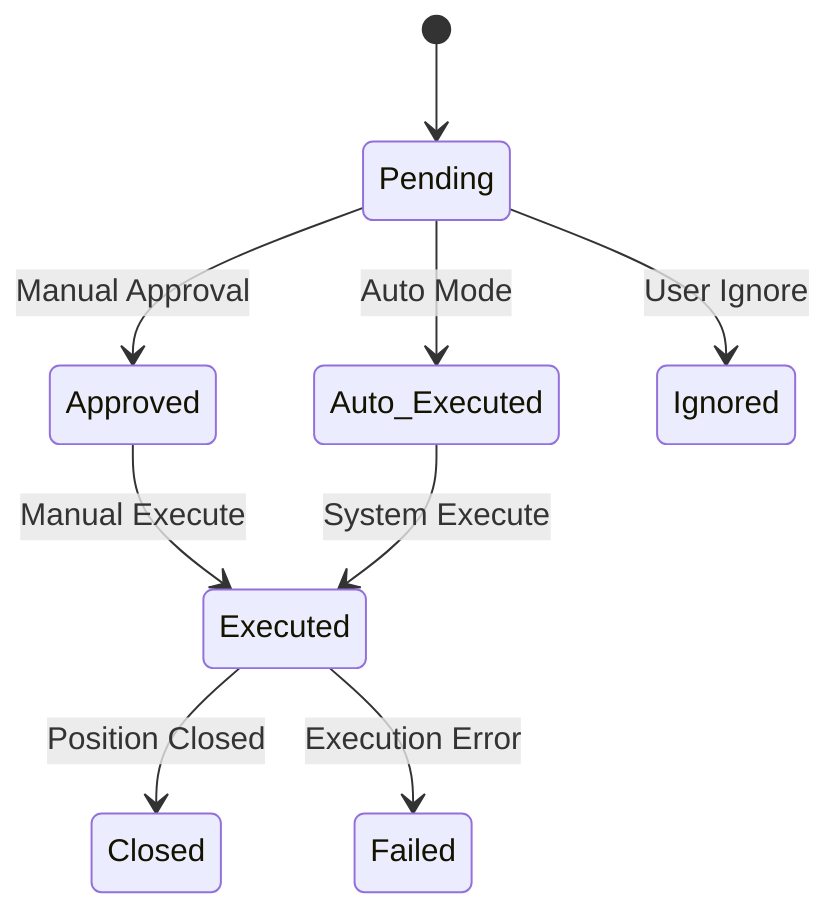
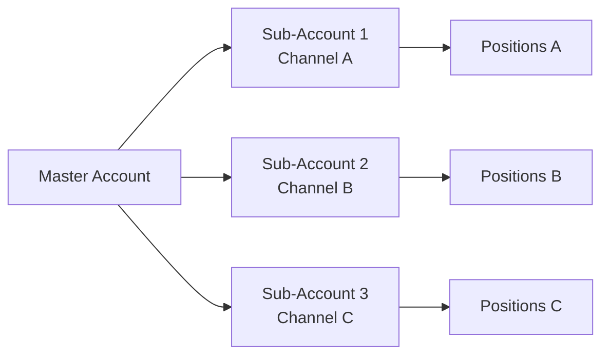
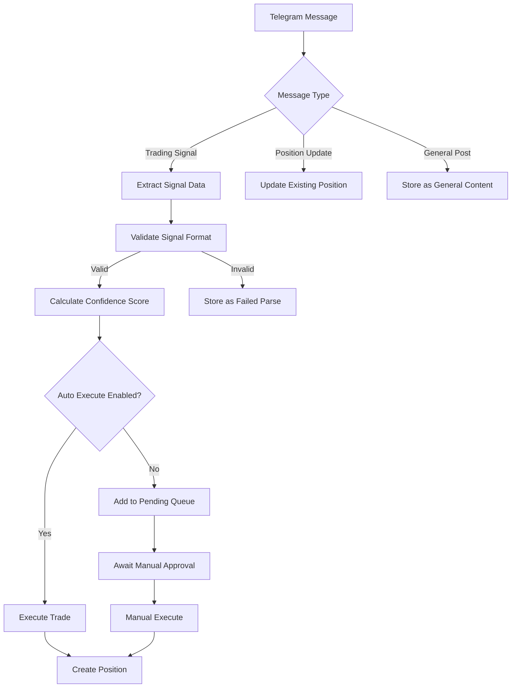

# Crypto Trading Bot Service Design

## Overview

A comprehensive service for monitoring Telegram channels with cryptocurrency trading signals and executing automated trades on BingX exchange. The system provides signal feed monitoring, automated/manual signal execution, channel management, dashboard for position tracking, and sub-account trading isolation.

### Key Features
- Telegram channel monitoring for trading signals
- Signal recognition using ChatGPT with SOT (System of Thought)
- Automated and manual signal execution on BingX
- Channel management (add/remove/pause)
- Sub-account trading for channel isolation
- Real-time dashboard with positions, PnL, and balance
- Configurable position sizing by deposit percentage

## Architecture

### System Components



### Technology Stack
- **Backend**: Node.js/Python with Express/FastAPI
- **Database**: PostgreSQL with Redis for caching
- **Message Queue**: Redis/RabbitMQ for signal processing
- **External APIs**: Telegram Bot API, BingX API, OpenAI API
- **Frontend**: React.js with real-time updates
- **WebSockets**: Socket.io for real-time communication

## Core Services

### 1. Telegram Signal Monitor



#### Responsibilities
- Monitor configured Telegram channels
- Capture all messages and media
- Filter out non-trading content
- Forward messages to signal recognizer

#### Configuration
```typescript
interface ChannelConfig {
  channelId: string;
  channelName: string;
  isActive: boolean;
  isPaused: boolean;
  subAccountId: string;
  maxPositionSize: number;
  riskPercentage: number;
}
```

### 2. Signal Recognition Service

#### ChatGPT Integration with SOT
- **System of Thought (SOT)**: Multi-step reasoning process
- **Signal Pattern Recognition**: Extract trading parameters
- **Content Classification**: Distinguish signals from general posts

#### Signal Parsing Logic
```typescript
interface TradingSignal {
  coin: string;
  direction: 'LONG' | 'SHORT';
  leverage: number;
  entryPrice: number;
  takeProfitLevels: number[];
  stopLoss: number;
  suggestedVolume?: number;
  confidence: number;
  timestamp: Date;
  channelId: string;
  rawMessage: string;
}
```

#### Recognition Patterns
1. **Entry Signals**: Coin name, direction, leverage, entry price
2. **Take Profit Updates**: TP level modifications
3. **Stop Loss Updates**: SL adjustments
4. **Position Management**: Hold, close, modify instructions

### 3. Signal Feed Service

#### Signal States


#### Feed Management
- Real-time signal stream
- Signal approval workflow
- Historical signal archive
- Signal performance tracking

### 4. Trading Execution Engine

#### Order Management
```typescript
interface TradeExecution {
  signalId: string;
  subAccountId: string;
  symbol: string;
  side: 'BUY' | 'SELL';
  type: 'MARKET' | 'LIMIT';
  quantity: number;
  price?: number;
  leverage: number;
  takeProfitOrders: TakeProfitOrder[];
  stopLossOrder: StopLossOrder;
  status: ExecutionStatus;
}
```

#### Risk Management
- Position size calculation based on % of sub-account balance
- Maximum exposure limits per channel
- Stop-loss enforcement
- Take-profit level management

### 5. Sub-Account Management

#### Account Isolation


#### Features
- Dedicated balance per channel
- Isolated risk management
- Independent P&L tracking
- Cross-account balance transfers

### 6. Channel Management Service

#### Channel Operations
```typescript
interface ChannelManagement {
  addChannel(config: ChannelConfig): Promise<void>;
  removeChannel(channelId: string): Promise<void>;
  pauseChannel(channelId: string): Promise<void>;
  resumeChannel(channelId: string): Promise<void>;
  updateChannelSettings(channelId: string, settings: Partial<ChannelConfig>): Promise<void>;
}
```

#### Channel Settings
- Auto-execution toggle
- Position size percentage
- Risk limits
- Take-profit strategy
- Stop-loss strategy

## Data Models

### Database Schema

#### Channels Table
```sql
CREATE TABLE channels (
  id UUID PRIMARY KEY,
  telegram_channel_id VARCHAR NOT NULL UNIQUE,
  name VARCHAR NOT NULL,
  is_active BOOLEAN DEFAULT true,
  is_paused BOOLEAN DEFAULT false,
  sub_account_id VARCHAR NOT NULL,
  max_position_percentage DECIMAL(5,2) DEFAULT 10.00,
  auto_execute BOOLEAN DEFAULT false,
  created_at TIMESTAMP DEFAULT NOW(),
  updated_at TIMESTAMP DEFAULT NOW()
);
```

#### Signals Table
```sql
CREATE TABLE signals (
  id UUID PRIMARY KEY,
  channel_id UUID REFERENCES channels(id),
  coin VARCHAR NOT NULL,
  direction VARCHAR NOT NULL,
  leverage INTEGER,
  entry_price DECIMAL(20,8),
  take_profit_levels DECIMAL(20,8)[],
  stop_loss DECIMAL(20,8),
  confidence_score DECIMAL(3,2),
  raw_message TEXT,
  message_timestamp TIMESTAMP,
  processed_at TIMESTAMP DEFAULT NOW(),
  status VARCHAR DEFAULT 'pending'
);
```

#### Positions Table
```sql
CREATE TABLE positions (
  id UUID PRIMARY KEY,
  signal_id UUID REFERENCES signals(id),
  sub_account_id VARCHAR NOT NULL,
  symbol VARCHAR NOT NULL,
  side VARCHAR NOT NULL,
  quantity DECIMAL(20,8),
  entry_price DECIMAL(20,8),
  current_price DECIMAL(20,8),
  unrealized_pnl DECIMAL(20,8),
  realized_pnl DECIMAL(20,8),
  status VARCHAR DEFAULT 'open',
  opened_at TIMESTAMP DEFAULT NOW(),
  closed_at TIMESTAMP
);
```

## API Endpoints Reference

### Channel Management Endpoints

#### GET /api/channels
**Description**: Retrieve all configured channels
**Response**:
```json
{
  "channels": [
    {
      "id": "uuid",
      "name": "Channel Name",
      "telegramChannelId": "string",
      "isActive": true,
      "isPaused": false,
      "subAccountId": "string",
      "maxPositionPercentage": 10.0,
      "autoExecute": false
    }
  ]
}
```

#### POST /api/channels
**Description**: Add new channel
**Request Body**:
```json
{
  "telegramChannelId": "string",
  "name": "string",
  "subAccountId": "string",
  "maxPositionPercentage": 10.0,
  "autoExecute": false
}
```

#### PUT /api/channels/:id/pause
**Description**: Pause/resume channel monitoring

#### DELETE /api/channels/:id
**Description**: Remove channel configuration

### Signal Management Endpoints

#### GET /api/signals
**Description**: Retrieve signal feed with filtering
**Query Parameters**:
- `channelId`: Filter by channel
- `status`: Filter by signal status
- `limit`: Number of signals to return
- `offset`: Pagination offset

#### POST /api/signals/:id/execute
**Description**: Manually execute a pending signal
**Request Body**:
```json
{
  "positionSize": 100.0,
  "leverage": 25
}
```

#### PUT /api/signals/:id/ignore
**Description**: Mark signal as ignored

### Position Management Endpoints

#### GET /api/positions
**Description**: Retrieve all open positions
**Response**:
```json
{
  "positions": [
    {
      "id": "uuid",
      "symbol": "SANDUSDT",
      "side": "SHORT",
      "quantity": 1000,
      "entryPrice": 0.29889,
      "currentPrice": 0.29500,
      "unrealizedPnl": 38.90,
      "leverage": 25,
      "channelName": "Channel Name"
    }
  ]
}
```

#### POST /api/positions/:id/close
**Description**: Manually close position

#### PUT /api/positions/:id/modify
**Description**: Modify stop-loss or take-profit levels

### Dashboard Endpoints

#### GET /api/dashboard/overview
**Description**: Get dashboard overview data
**Response**:
```json
{
  "totalBalance": 5000.0,
  "totalPnl": 150.75,
  "openPositions": 5,
  "channelPnl": [
    {
      "channelId": "uuid",
      "channelName": "Channel A",
      "pnl": 75.25,
      "winRate": 65.5
    }
  ]
}
```

## Business Logic Layer

### Signal Processing Workflow



### Risk Management Engine

#### Position Sizing Algorithm
```typescript
function calculatePositionSize(
  signal: TradingSignal,
  accountBalance: number,
  riskPercentage: number
): number {
  const riskAmount = accountBalance * (riskPercentage / 100);
  const entryPrice = signal.entryPrice;
  const stopLoss = signal.stopLoss;
  const riskPerUnit = Math.abs(entryPrice - stopLoss);
  const maxQuantity = riskAmount / riskPerUnit;
  
  return maxQuantity;
}
```

#### Risk Limits
- Maximum 50% of sub-account balance per position
- Maximum 5 concurrent positions per channel
- Stop-loss mandatory for all positions
- Maximum leverage: 50x

### P&L Calculation Engine

#### Real-time P&L Updates
```typescript
interface PnLCalculation {
  unrealizedPnl: number;
  realizedPnl: number;
  totalFees: number;
  roi: number;
  winRate: number;
}

function calculateChannelPnL(channelId: string): Promise<PnLCalculation> {
  // Aggregate all positions for channel
  // Calculate unrealized P&L for open positions
  // Sum realized P&L for closed positions
  // Calculate win rate and ROI
}
```

## WebSocket Events

### Real-time Data Streams

#### Signal Feed Events
```typescript
// New signal received
socket.emit('signal:new', {
  signalId: 'uuid',
  coin: 'SAND',
  direction: 'SHORT',
  channelName: 'Channel A',
  timestamp: '2024-01-01T12:00:00Z'
});

// Signal executed
socket.emit('signal:executed', {
  signalId: 'uuid',
  positionId: 'uuid',
  executionPrice: 0.29889
});
```

#### Position Updates
```typescript
// Position P&L update
socket.emit('position:update', {
  positionId: 'uuid',
  currentPrice: 0.29500,
  unrealizedPnl: 38.90,
  pnlChange: 5.20
});

// Position closed
socket.emit('position:closed', {
  positionId: 'uuid',
  closePrice: 0.29618,
  realizedPnl: 75.30
});
```

#### Account Updates
```typescript
// Balance update
socket.emit('account:balance', {
  subAccountId: 'string',
  totalBalance: 1500.75,
  availableBalance: 1200.50
});
```

## Testing Strategy

### Unit Testing
- Signal parsing logic validation
- Position sizing calculations
- P&L calculation accuracy
- Risk management rules

### Integration Testing
- Telegram API message handling
- BingX API order execution
- Database operations
- WebSocket event delivery

### End-to-End Testing
- Complete signal-to-execution workflow
- Channel management operations
- Dashboard data accuracy
- Multi-channel concurrent trading

### Performance Testing
- Message processing throughput
- Real-time update latency
- Database query optimization
- API response times

## Security Considerations

### API Security
- BingX API key encryption at rest
- Telegram bot token secure storage
- Request rate limiting
- Input validation and sanitization

### Trading Security
- Position limits enforcement
- Sub-account isolation
- Unauthorized access prevention
- Trade execution logging

### Data Protection
- Sensitive data encryption
- Audit trail maintenance
- User session management
- Secure WebSocket connections


